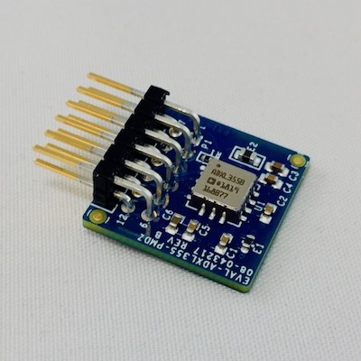
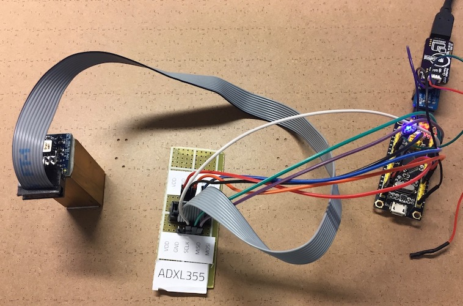

# ADXL355 embedded-hal SPI driver crate




## Usage

Include [library](https://crates.io/crates/adxl355) as a dependency in your Cargo.toml


```
[dependencies.adxl355]
version = "<version>"
```

Use embedded-hal implementation to get SPI and a GPIO OutputPin for the chip select, then create the accelerometer handle

```rust

use adxl355::{Adxl355, Accelerometer};

// to create sensor with default configuration:
let mut accelerometer = Adxl355::default(spi, cs)?;

// start measurements
accelerometer.start();

// to get 3d accerlation data:
let accel = accelerometer.acceleration()?;
println!("{:?}", accel);


// One can also use conf module to supply configuration:

use adxl355::{Adxl355, Config as ADXLConfig, ODR_LPF, Range, Accelerometer};

Adxl355::new(spi, cs,
                     ADXLConfig::new()
                     .odr(ODR_LPF::ODR_31_25_Hz)
                     .range(Range::_2G))?;
```

## Running the examples

### Blackpill board (STM32F103)



Example based on the stm32f103 microcontroller [`examples/blackpill.rs`]

To build an example

```bash
cargo build --example blackpill --features="stm32f103"
```

And run immediately. Flashing with black magic probe using `bmp.sh` script (only works for MacOS at the moment).

```bash
cargo run --example blackpill --features="stm32f103"
```

### STM32G070

Example based on the stm32g070 microcontroller [`examples/stm32g070.rs`]

To build an example

```bash
cargo build --example stm32g070 --features=stm32g070 --target thumbv6m-none-eabi
```

The resulting ELF file can be found under `target/thumbv6m-none-eabi/examples/`.

To run immediately

```bash
cargo run --example stm32g070 --features=stm32g070 --target thumbv6m-none-eabi
```

This will make use of `flash.sh` that assumes the [st-link utilities](https://github.com/texane/stlink) are available in your PATH.


Example with normalized data

```bash
cargo run --example norm_stm32g070 --features=stm32g070 --target thumbv6m-none-eabi
```